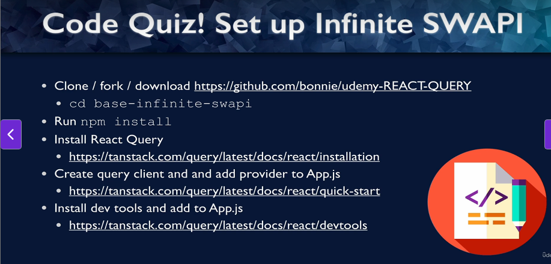
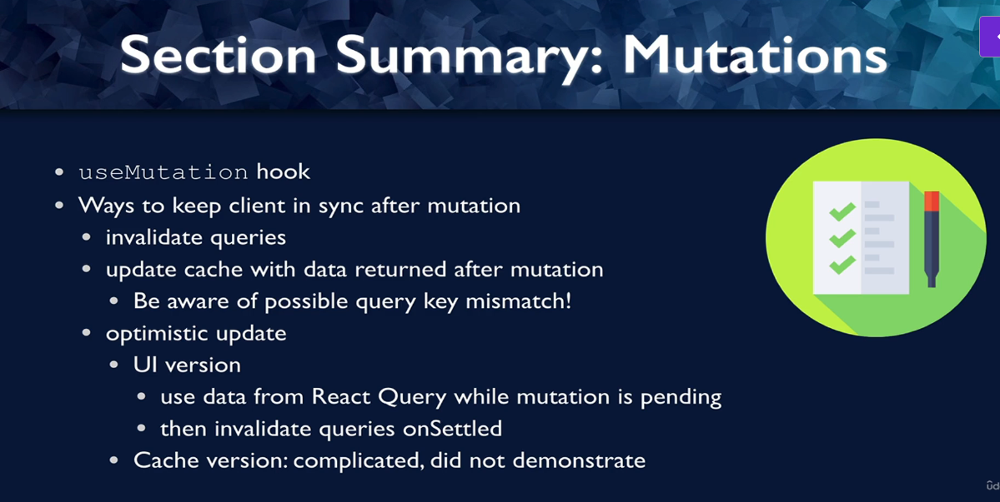

# React Query/TanStack Query: React Server State Management
- React Query is a library that manages server state for our React App
- 

### What problem does React Query solve?
- 
- 
- 
- React Query maintains Loading/Error States
- It gives us tools for Pagination/infinite scroll
- We can pre-fetch data, put it in the cache and then if the user wants data, it can get from the cache
- React Query can also manage mutations or updating the data from the server
- React Query can help in de-duplication of requests
- It also supports Retry on Error
- It also provides callbacks so that we can take actions of query is successful, or it resulted in an error
- 
- 

### First project
- 
- 
- 

### Getting started
- Install React-Query
```shell
npm install @tanstack/react-query
```
- Create a query client(which will manage queries and cache)\
- We will apply a Query Provider which provides client config and cache to the children
- It also takes the query client as the value
- Call useQuery() to fetch data from the server

### Adding a Query Client and Provider
- 
- Add the following code to App.jsx to add the query client and query client provider
```jsx
import { Posts } from "./Posts";
import "./App.css";
import {QueryClient,QueryClientProvider} from "@tanstack/react-query";

const queryClient = new QueryClient();

function App() {
  return (
    // provide React Query client to App
      <QueryClientProvider client={queryClient}>
    <div className="App">
      <h1>Blog &apos;em Ipsum</h1>
      <Posts />
    </div>
      </QueryClientProvider>
  );
}

export default App;

```
- The data we will get from the server looks like this
- 
- To use ReactQuery use the following code:
```jsx
import {useQuery} from "@tanstack/react-query"
const {data} = useQuery({
    //Defines the data inside the query cache. Always an array
    queryKey: ["posts"],
    //Function that will run to fetch the data
    queryFn: fetchPosts,
});
return (
    <>
        <ul>
            {data.map((post) => (
                <li
                    key={post.id}
                    className="post-title"
                    onClick={() => setSelectedPost(post)}
                >
                    {post.title}
                </li>
            ))}
        </ul>
    </>
);
```
- Note that fetchPosts is an async function and it will take some time to return data
- So we need to do this
```jsx
 // replace with useQuery
const {data} = useQuery({
    //Defines the data inside the query cache. Always an array
    queryKey: ["posts"],
    //Function that will run to fetch the data
    queryFn: fetchPosts,
});

if(!data)
{
    return <div>Loading...</div>;
}
return (
    <>
        <ul>
            {data && data.map((post) => (
                <li
                    key={post.id}
                    className="post-title"
                    onClick={() => setSelectedPost(post)}
                >
                    {post.title}
                </li>
            ))}
        </ul>
</>
)
```

### Handling Loading and Error States
- 
- We can make changes as follows to use isLoading and isError
```jsx
const {data, isError, isLoading} = useQuery({
    //Defines the data inside the query cache. Always an array
    queryKey: ["posts"],
    //Function that will run to fetch the data
    queryFn: fetchPosts,
});

if(isLoading)
{
    return <h3>Loading...</h3>;
}
```
### Difference between isLoading and isFetching and isError
- isFetching means the async query hasnt resolved
- isLoading is a subset of that. It means we have noCachedData and data isFetching
- isError means something went wrong
```jsx
if(isError)
  {
      return <h3>Error!</h3>;
  }
```
- Notice that React-Query tries to fetch the data minimum 3 times before it errors out
- This is configurable though
- 

### Using React-Query Dev Tools
- It shows status of all of our queries and last updated timestamp
- It also has a data-explorer to view data returned by query
- It has a query explorer also where we can see the queries
- DEV_TOOLs are not included in production
- It looks at process.env.NODE_ENV === 'development'
- Include them in App.jsx as follows:
```jsx
import { Posts } from "./Posts";
import "./App.css";
import {QueryClient,QueryClientProvider} from "@tanstack/react-query";
import {ReactQueryDevtools} from "@tanstack/react-query-devtools";

const queryClient = new QueryClient();

function App() {
    return (
        // provide React Query client to App
        <QueryClientProvider client={queryClient}>
            <div className="App">
                <h1>Blog &apos;em Ipsum</h1>
                <Posts />
            </div>
            <ReactQueryDevtools />
        </QueryClientProvider>
    );
}

export default App;

```
- 

### What are stale queries?
- Stale data is data that is expired and is ready to be re-fetched
- Data is still in the cache though
- Stale means that Data is stale while revalidating
- This means show this stale data till we get the latest data from server to show latest data
- Data refetch only triggers when data is stale
- Data refetch is also triggered if the component remounts or browser window refocuses
- StaleTime is the maxAge means how much are we willing to tolerate the data being out of date
```jsx
const {data, isError, isLoading} = useQuery({
    //Defines the data inside the query cache. Always an array
    queryKey: ["posts"],
    //Function that will run to fetch the data
    queryFn: fetchPosts,
    staleTime: 2000, //2 seconds
});
```
- Please note data needs to be stale, for refetch triggers to be triggered
- 
- By defaulting to stateTime of 0, we are always assuming data is out of date, and it needs to be refetched from the server
- That makes it much less likely that we will have out of date data on the client application

### Staletime vs gcTime
- 
- 

## Pagination, Pre-fetching and Mutations
- Now we need to fetch the comments.
- 
- We pass the post to a PostDetail component which fetches the comments
- We will make changes to PostDetail component as follows:
```jsx
import { fetchComments } from "./api";
import "./PostDetail.css";
import {useQuery} from "@tanstack/react-query";

export function PostDetail({ post }) {
  console.log(post);
  const {data,isLoading,isError, error } = useQuery({
      queryKey: ["comments",post.id],
      queryFn: ()=> fetchComments(post.id),
  })

    if(isLoading) {
        return(
            <div>Loading...</div>
        )
    }

    if(isError)
    {
        return <h3>Error!</h3>;
    }

  return (
    <>
      <h3 style={{ color: "blue" }}>{post.title}</h3>
      <button>Delete</button> <button>Update title</button>
      <p>{post.body}</p>
      <h4>Comments</h4>
      {data && data.map((comment) => (
        <li key={comment.id}>
          {comment.email}: {comment.body}
        </li>
      ))}
    </>
  );
}

```
### Key Changes Made:
- Fixed queryFn: Changed from fetchComments(post.id) to () => fetchComments(post.id)
- Updated queryKey: Added post.id to the query key as ["comments", post.id] so React Query can cache comments per post

### Why This Matters:
- Without the arrow function: fetchComments(post.id) executes immediately when the component renders, and React Query receives the Promise result instead of a function
- With the arrow function: () => fetchComments(post.id) passes a function that React Query can call when it needs to fetch data

### Understanding Query Keys
- 
- 
- 
- Note the queryFn relies on post.id, so we need to add post.id as a dependency array
- 
- 
- 
- So we can see some active queries and inactive queries
- For inactive queries, the gc time clock is ticking
- After the gctime has passed, they will be automatically garbage collected
- Think of this as, whenever we make a query, the results of that query are cached
- When we make a new query, the results of previous query are still in the cache
- If that old query is reused, then results come straight from the cache, else if gctime has passed, it is garbage collected and removed from cache

### Pagination
- 
- We write the following code in Posts.jsx file
```jsx
import { useState } from "react";

import { fetchPosts, deletePost, updatePost } from "./api";
import { PostDetail } from "./PostDetail";
import {useQuery} from "@tanstack/react-query"
const maxPostPage = 10;

export function Posts() {
  const [currentPage, setCurrentPage] = useState(1);
  const [selectedPost, setSelectedPost] = useState(null);

  const {data, isError, isLoading} = useQuery({
      //Defines the data inside the query cache. Always an array
      queryKey: ["posts", currentPage],
      //Function that will run to fetch the data
      queryFn: ()=> fetchPosts(currentPage),
      staleTime: 2000, //2 seconds
  });

  if(isLoading)
  {
      return <h3>Loading...</h3>;
  }
  if(isError)
  {
      return <h3>Error!</h3>;
  }
  return (
    <>
      <ul>
        {data && data.map((post) => (
          <li
            key={post.id}
            className="post-title"
            onClick={() => setSelectedPost(post)}
          >
            {post.title}
          </li>
        ))}
      </ul>
      <div className="pages">
        <button disabled = {currentPage <= 1} onClick={() => {
            setCurrentPage((previousValue) => previousValue - 1);
        }}>
          Previous page
        </button>
        <span>Page {currentPage}</span>
        <button disabled = {currentPage >= maxPostPage} onClick={() => {
            setCurrentPage((previousValue) => previousValue + 1)
        }}>
          Next page
        </button>
      </div>
      <hr />
      {selectedPost && <PostDetail post={selectedPost} />}
    </>
  );
}

```

### Prefetching data
- 
- Prefetching is a method of the query client
- We can get a reference to the query client inside a component using the useQueryClient hook
- We have a prefetch query function that will fetch data for the next page
- We have to prefetch the data inside the useEffect to keep tracking of which page we are on and we want to run this function when we go to the next page
```jsx
const [currentPage, setCurrentPage] = useState(1);
const [selectedPost, setSelectedPost] = useState(null);

const queryClient = useQueryClient();

useEffect(() => {
    if(currentPage < maxPostPage) {
        const nextPage = currentPage + 1;
        queryClient.prefetchQuery({
            query: ["posts", nextPage],
            queryFn: () => fetchPosts(nextPage),
        });
    }
},[currentPage,queryClient]);

const {data, isError, isLoading} = useQuery({
    //Defines the data inside the query cache. Always an array
    queryKey: ["posts", currentPage],
    //Function that will run to fetch the data
    queryFn: ()=> fetchPosts(currentPage),
    staleTime: 2000, //2 seconds
});
```
- This really reduces loading time and provides a nice experience to the user

### isLoading vs isFetching
- 
```jsx
// First time loading
data: undefined
isLoading: true    // Show spinner
isFetching: true

// Background refetch with cached data
data: [...existing data...]
isLoading: false   // Don't show spinner
isFetching: true   // Still fetching new data

```
- Use isLoading when you want to show a loading spinner only for the initial data load.
- Use isFetching when you want to indicate any network activity, including background refreshes.
- For most UI patterns, isLoading is preferred because it prevents showing loading spinners every time React Query refetches data in the background.
- isLoading indicates initial data fetch, isFetching shows any ongoing fetch process

### Intro to Mutations
- 
- 
- To add a delete mutation add the following code to Posts.jsx
- Note that we can pass arguments to mutations
```jsx
import {useQuery, useQueryClient, useMutation} from "@tanstack/react-query"
import { fetchPosts, deletePost, updatePost } from "./api";

const deleteMutation = useMutation({
    //No need to add mutation Key
    mutationFn: (postId) => deletePost(postId),
})

{selectedPost && <PostDetail post={selectedPost} deleteMutation = {deleteMutation} />}
```
- Now inside the PostDetail component we have this code:
```jsx
export function PostDetail({ post, deleteMutation }) {
    const {data,isLoading,isError, error } = useQuery({
        queryKey: ["comments",post.id],
        queryFn: ()=> fetchComments(post.id),
    })

    return (
        <>
            <h3 style={{ color: "blue" }}>{post.title}</h3>
            // Specify arguments for the mutation
            <button onClick={()=>deleteMutation.mutate(post.id)}>Delete</button> <button>Update title</button>
            <p>{post.body}</p>
            <h4>Comments</h4>
            {data && data.map((comment) => (
                <li key={comment.id}>
                    {comment.email}: {comment.body}
                </li>
            ))}
        </>
    );
```
- The arguments for useMutation are less than that for useQuery
- There is no isLoading and isFetching properties
- We do have isPending
```jsx
return (
    <>
      <h3 style={{ color: "blue" }}>{post.title}</h3>
      <div>
        <button onClick={()=>deleteMutation.mutate(post.id)}>
            Delete
        </button>
          {deleteMutation.isPending && (
              <p className="loading">Deleting the Post</p>
          )}
          {deleteMutation.isError && (
              <p className="error">Error Deleting the Post: {deleteMutation.error.toString()}</p>
          )}
          {deleteMutation.isSuccess && (
              <p className="success">Post was Deleted</p>
          )}
      </div>
          <button>Update title</button>
      <p>{post.body}</p>
      <h4>Comments</h4>
      {data && data.map((comment) => (
        <li key={comment.id}>
          {comment.email}: {comment.body}
        </li>
      ))}
    </>
  );
```
- We need to reset the mutation when we click on a different post
- The reset function resets all the mutation properties
- This can be done by the following code:
```jsx
return (
    <>
      <ul>
        {data && data.map((post) => (
          <li
            key={post.id}
            className="post-title"
            onClick={() => {
                deleteMutation.reset()
                setSelectedPost(post);
            }}
          >
            {post.title}
          </li>
        ))}
      </ul>
)
```
### Updating the Post Title
- 
- The code is exactly similar to deleteMutation code above
```jsx

const updateMutation = useMutation({
        mutationFn: (postId) => updatePost(postId),
    })
    
 <div>
          <button onClick={()=>updateMutation.mutate(post.id)}>
              Update title
          </button>
            {updateMutation.isPending && (
                <p className="loading">Updating the Post</p>
            )}
            {updateMutation.isError && (
                <p className="error">Error Updating the Post: {updateMutation.error.toString()}</p>
            )}
            {updateMutation.isSuccess && (
                <p className="success">Post was Updated</p>
            )}
</div>
```
### Summary of React-Query Basics
- 

## Infinite Scroll - Infinite Queries for Loading Data (Just in Time)
- 
- We will use a new hook useInfiniteQuery
- 
- 

```jsx
import "./App.css";
import { InfinitePeople } from "./people/InfinitePeople";
import { InfiniteSpecies } from "./species/InfiniteSpecies";
import {QueryClient,QueryClientProvider} from "@tanstack/react-query";
import {ReactQueryDevtools} from "@tanstack/react-query-devtools";

function App() {
  return (
      <QueryClientProvider client={queryClient}>
    <div className="App">
      <h1>Infinite SWAPI</h1>
      <InfinitePeople />
      {/* <InfiniteSpecies /> */}
    </div>
          <ReactQueryDevtools />
      </QueryClientProvider>
  );
}

export default App;

```
### useInfiniteQuery
- 
- 
- 
- 
- 
- Initial when the component mounts and we fetch the first page, the data is undefined
- Then we fetch the first page
- 
- It sets the first property of the data.pages object
- After we get the data back, React Query will run the getNextPageParam
- 
- Then we check if there is a next Page
- 
- Then we run the getNextPageParam
- If getNextPageParam is undefined, it means there are no more pages
- So hasNextPage is false and we are done
- 
- Initial code for useInfiniteQuery is as follows:
```jsx
import InfiniteScroll from "react-infinite-scroller";
import { Person } from "./Person";
import {useInfiniteQuery} from "@tanstack/react-query"

const initialUrl = "https://swapi-node.now.sh/api/people";
const fetchUrl = async (url) => {
  const response = await fetch(url);
  return response.json();
};

export function InfinitePeople() {

    //fetch Next page is called when we want to load more data
  const {data, fetchNextPage, hasNextPage} = useInfiniteQuery({
    queryKey:["sw-people"],
    queryFn: ({pageParam = initialUrl}) => fetchUrl(pageParam),
    getNextPageParam: (lastPage) =>{
      return lastPage.next || undefined;
    }
  })
```
### React Infinite Scroller
- 
- Code will be as follows:
```jsx
import InfiniteScroll from "react-infinite-scroller";
import { useInfiniteQuery } from "@tanstack/react-query";
import { Person } from "./Person";

const baseUrl = "https://swapi-node.vercel.app";
const initialUrl = baseUrl + "/api/people/";
const fetchUrl = async (url) => {
  const response = await fetch(url);
  return response.json();
};

export function InfinitePeople() {
  const {
    data,
    fetchNextPage,
    hasNextPage,
    isFetching,
    isLoading,
    isError,
    error,
  } = useInfiniteQuery({
    queryKey: ["sw-people"],
    queryFn: ({ pageParam = initialUrl }) => fetchUrl(pageParam),
    getNextPageParam: (lastPage) => {
      return lastPage.next ? baseUrl + lastPage.next : undefined;
    },
  });

  if (isLoading) {
    return <div className="loading">Loading...</div>;
  }

  if (isError) {
    return <div>Error! {error.toString()}</div>;
  }

  return (
      <>
        {isFetching && <div className="loading">Loading...</div>}
        <InfiniteScroll
            loadMore={() => {
              if (!isFetching) {
                fetchNextPage();
              }
            }}
            hasMore={hasNextPage}
        >
          {data.pages.map((pageData) => {
            return pageData.results.map((person) => {
              return (
                  <Person
                      key={person.fields.name}
                      name={person.fields.name}
                      hairColor={person.fields.hair_color}
                      eyeColor={person.fields.eye_color}
                  />
              );
            });
          })}
        </InfiniteScroll>
      </>
  );
}
```
- We can write similar code for InfiniteSpecies

### Bi-directional Scrolling
- 
- getPreviousPageParam
- 

## React Query in a larger app
- We will try to centralize error logging
- We will use custom hooks for useQuery rather than use useQuery directly in the components
- 
- 
- We can lazy load the react-query-devtools in the development also
- We can call windows.toggleDevtools() to enable devTools in production
- We will install eslint plugin for react-query
- To install anything as a dev dependencies we will add the -D switch along the command
```shell
npm i -D @tanstack/eslint-plugin-query
```
- We can set up aliases to our folders in the tsconfig.json file
- 

### Setting up React Query in App.tsx for client
- Include the following code in App.tsx to install React Query Client, Query Client Provider and ReactQueryDevTools
- Please note that rather than defining an instance of queryClient we define it inside a queryClient.ts file
- This allows us to import the instance whenever we need it
- Then make the following changes in App.tsx
```jsx
import {queryClient} from "@/react-query/queryClient";
import {QueryClientProvider} from "@tanstack/react-query";
import {ReactQueryDevtools} from "@tanstack/react-query-devtools";

<QueryClientProvider client={queryClient}>
    <AuthContextProvider>
        <Loading />
        <BrowserRouter>
            <Navbar />
            <Routes>
                <Route path="/" element={<Home />} />
                <Route path="/Staff" element={<AllStaff />} />
                <Route path="/Calendar" element={<Calendar />} />
                <Route path="/Treatments" element={<Treatments />} />
                <Route path="/signin" element={<Signin />} />
                <Route path="/user/:id" element={<UserProfile />} />
            </Routes>
        </BrowserRouter>
        <ToastContainer />
    </AuthContextProvider>
    <ReactQueryDevtools></ReactQueryDevtools>
</QueryClientProvider>
```
### Custom Query Hook: useTreatments
- In larger apps, we make custom hooks for each type of data
- This makes it accessible from multiple components
- This also eliminates the risk of mixing up keys
- It also encapsulates the queryFn in a custom hook
- Also, it abstracts the implementation from the Presentation Layer
- We can update the implementation without affecting other components
- Code for useTreatments is as follows:
```jsx
import type { Treatment } from "@shared/types";
import {useQuery} from "@tanstack/react-query";
import { axiosInstance } from "@/axiosInstance";
import { queryKeys } from "@/react-query/constants";

// for when we need a query function for useQuery
async function getTreatments(): Promise<Treatment[]> {
  const { data } = await axiosInstance.get('/treatments');
  return data;
}

export function useTreatments(): Treatment[] {
    //specify a default value
  const fallback : Treatment[] = []
    //initialize data to be default value
  const {data = fallback} = useQuery({
   queryKey: [queryKeys.treatments],
   queryFn: getTreatments,
 })
  return data;
}

```

### Centralized Fetching Indicator (useInFetching)
- 
- We will modify the Loading.tsx as follows
```jsx
import { Spinner, Text } from "@chakra-ui/react";
import {useIsFetching} from "@tanstack/react-query";

export function Loading() {
  // will use React Query `useIsFetching` to determine whether or not to display
  const isFetching = useIsFetching(); // returns an integer, if > 0, then query calls are still pending, if 0, then it will give false
  const display = isFetching ? "inherit" : "none";

  return (
    <Spinner
      thickness="4px"
      speed="0.65s"
      emptyColor="olive.200"
      color="olive.800"
      role="status"
      position="fixed"
      zIndex="9999"
      top="50%"
      left="50%"
      transform="translate(-50%, -50%)"
      display={display}
    >
      <Text display="none">Loading...</Text>
    </Spinner>
  );
}

```

### Global Callback to show a toast message everytime there is an error
- 
- We will setup the error handler as follows:
```jsx
import { toast } from "@/components/app/toast";
import {QueryCache, QueryClient} from "@tanstack/react-query";

function errorHandler(errorMsg: string) {
  // https://chakra-ui.com/docs/components/toast#preventing-duplicate-toast
  // one message per page load, not one message per query
  // the user doesn't care that there were three failed queries on the staff page
  //    (staff, treatments, user)
  const id = "react-query-toast";

  if (!toast.isActive(id)) {
    const action = "fetch";
    const title = `could not ${action} data: ${
      errorMsg ?? "error connecting to server"
    }`;
    toast({ id, title, status: "error", variant: "subtle", isClosable: true });
  }
}


export const queryClient = new QueryClient({
    queryCache: new QueryCache({
        onError: (error) => {
            errorHandler(error.message);
        },
    })
});

```
- It displays the error like this
- 
- Default retries for react query is 3

### Writing a custom hook for Staff Data
- 
- Code for useStaff is as follows
```jsx
import { useState } from "react";

import type { Staff } from "@shared/types";

import { filterByTreatment } from "../utils";

import { axiosInstance } from "@/axiosInstance";
import { queryKeys } from "@/react-query/constants";
import {useQuery} from "@tanstack/react-query";

//query function for useQuery
async function getStaff(): Promise<Staff[]> {
  const { data } = await axiosInstance.get('/staff');
  return data;
}
interface UseStaffReturn {
  staff: Staff[];
  filter: string;
  setFilter: (filter: string) => void;
}

export function useStaff() {
  // for filtering staff by treatment
  const [filter, setFilter] = useState("all");

  //fallback data
  const fallback: Staff[] = [];
  // TODO: get data from server via useQuery
  const {data:staff = fallback} = useQuery({
    queryKey: [queryKeys.staff],
    queryFn: getStaff,
  });
  return { staff, filter, setFilter };
}

```

### Summary
- Create a separate file for the Query Client
- Create custom hooks to create code modular and reusable
- We centralized the loading component using the useInFetching() hook for react-query
- We centralized the error handling using the onError callback inside the Query Client Cache

### Query Features: Pre-fetching and Pagination
- We want to pre-populate data if we know what we want user to see
- 
- In Prefetching data, we prefetch the next page's data while the user is being displayed the current page.
- 
- prefetchQuery is a method of the query client
- It is added to the client cache
- We make use of the useQueryClient hook which returns the queryClient within the Provider
- We will make a usePrefetchTreatments hook within the useTreatments.ts file.
- It uses the same queryFn and key as the useTreatments call
- We will call usePrefetchTreatments() from the Home component
- Idea is to add data to the cache in the background
- Data fetched using the prefetchQuery can be stale also when the user actually loads the page that uses that data
- We can always run useQuery() to get the latest data, but atleast we have something to show to the user
- But it must be within gcTime
- 
```jsx
export function usePrefetchTreatments(): void {
    //Get the queryClient instance passed to the QueryProvider
    const queryClient = useQueryClient();
    queryClient.prefetchQuery({
        queryKey:[queryKeys.treatments],
        queryFn: getTreatments,
    });
}
```
- We can then call it inside Home.tsx component
```jsx
import {usePrefetchTreatments} from "@/components/treatments/hooks/useTreatments";

import { BackgroundImage } from "@/components/common/BackgroundImage";

export function Home() {
    usePrefetchTreatments();
  return (
    <Stack textAlign="center" justify="center" height="84vh">
      <BackgroundImage />
      <Text textAlign="center" fontFamily="Forum, sans-serif" fontSize="6em">
        <Icon m={4} verticalAlign="top" as={GiFlowerPot} />
        Lazy Days Spa
      </Text>
      <Text>Hours: limited</Text>
      <Text>Address: nearby</Text>
    </Stack>
  );
}
```
- But would we want to call this usePrefetchTreatments() hook on every render of Home screen
- Ideally no, but cant we run it inside a useEffect() hook
- We cannot, since we cannot call other hooks inside other hooks
- Cant we just make it any other function
- No, since usePrefetchTreatments() uses the useQueryClient hook internally
- So it has to be a hook
- Notice that the treatments data is loaded in the queryClient on the first render of the Homepage
- 

### useAppointment Custom hook
- We can have the following code to get the list of appointments:
```jsx
// Notes:
//    1. appointments is an AppointmentDateMap (object with days of month
//       as properties, and arrays of appointments for that day as values)
//
//    2. The getAppointments query function needs monthYear.year and
//       monthYear.month
const fallback: AppointmentDateMap = {};

const {data: appointments = fallback} = useQuery({
    queryKey: [queryKeys.appointments],
    queryFn: ()=> getAppointments(monthYear.year, monthYear.month),
})
/** ****************** END 3: useQuery  ******************************* */

return { appointments, monthYear, updateMonthYear, showAll, setShowAll };
}
```
- But there is a problem, each time we move to a different month, we see the same data
- This is because we are using the same queryKey above
- This is not loading new data
- We are not triggering the refetch of data
- Data is refetched in the following scenarios:(only for a known key)
- When a component remounts
- When the window is refocussed
- When we trigger the refetch manually
- Or an automated refetch after a certain period of time
- One solution is to have a new key for each month
- We want to treat keys are dependency arrays
- We will change the code as follows:
```jsx
 const fallback: AppointmentDateMap = {};

const {data: appointments = fallback} = useQuery({
    queryKey: [queryKeys.appointments,monthYear.year, monthYear.month],
    queryFn: ()=> getAppointments(monthYear.year, monthYear.month),
})
/** ****************** END 3: useQuery  ******************************* */

return { appointments, monthYear, updateMonthYear, showAll, setShowAll };
}
```
- Now the queryKeys have the month and year appended to it
- 

### Prefetching for appointments pagination
- Remember setting state is an asynchronous operation in React
- 
- We will use prefetchQuery as follows:
```jsx
const queryClient = useQueryClient();
useEffect(() => {
    const nextMonthYear = getNewMonthYear(monthYear,1);
    queryClient.prefetchQuery({
        queryKey:[queryKeys.appointments,nextMonthYear.year,nextMonthYear.month],
        queryFn: () => getAppointments(nextMonthYear.year,nextMonthYear.month),
    })
},[queryClient,monthYear]);
```
- 
- Note that even though we are in August, we have prefetched the data for the next month

### Summary
- 

## Query Features: Transforming and Re-fetching data
- We will use select option to transform/filter data
- Similar to Project<> option in Entity Framework Core
- 
```jsx
const transformTodoNames = (data: Todos) =>
  data.map((todo) => todo.name.toUpperCase())

export const useTodosQuery = () =>
  useQuery({
    queryKey: ['todos'],
    queryFn: fetchTodos,
    // ✅ uses a stable function reference
    select: transformTodoNames,
  })

export const useTodosQuery = () =>
  useQuery({
    queryKey: ['todos'],
    queryFn: fetchTodos,
    // ✅ memoizes with useCallback
    select: React.useCallback(
      (data: Todos) => data.map((todo) => todo.name.toUpperCase()),
      []
    ),
  })
```
- This is the changes we need to make in useAppointments hook
```jsx
const {data: appointments = fallback} = useQuery({
    queryKey: [queryKeys.appointments,monthYear.year, monthYear.month],
    queryFn: ()=> getAppointments(monthYear.year, monthYear.month),
    //Apply transformation to the result returned from queryFn
    select: (data)=>selectFn(data,showAll),
})

// Not referentially stable, It is going to get redefined every time the hook gets run
//Need to make use of useCallback hook
//useCallback is a memoizer for functions
const selectFn = useCallback((data:AppointmentDateMap, showAll:boolean) =>{
        if(showAll) return data;
        return getAvailableAppointments(data,userId);
    },
    [userId]);
```
- 
- Solution is as follows:
```tsx
export function useStaff() {
    // for filtering staff by treatment
    const [filter, setFilter] = useState("all");

    const selectFn = useCallback((unfilteredStaff: Staff[]) => {
        if (filter === 'all') return unfilteredStaff;
        return filterByTreatment(unfilteredStaff, filter); // ✅ Return filtered data directly
    }, [filter]);

    //fallback data
    const fallback: Staff[] = [];
    // TODO: get data from server via useQuery
    const {data:staff = fallback} = useQuery({
        queryKey: [queryKeys.staff],
        queryFn: getStaff,
        //Apply transformation to the result returned from queryFn
        select: selectFn,
    });
    return { staff, filter, setFilter };
}
```
### Intro to Re-fetch
- Re-fetch ensures stale data gets updated from the server
- 
- Re-fetching can be configured globally or on a specific query options
- 
- We can suppress re-fetch also
- 

### Re-fetch options
- We can only configure re-fetch options for useQuery and not prefetchQuery
- Here we are manually disabling re-fetching for a particular query
```jsx
export function useTreatments(): Treatment[] {
    const fallback : Treatment[] = []
    const {data = fallback} = useQuery({
        queryKey: [queryKeys.treatments],
        queryFn: getTreatments,
        staleTime:600000, //10 minutes
        gcTime: 900000, //15 minutes
        refetchOnMount: false,
        refetchOnWindowFocus: false,
        refetchOnReconnect: false,
    });
    return data;
}

```
### Global refetch options
- The above options for re-fetching were specific to a query
- What if we want to apply these re-fetching settings globally?
- 
- We will change these settings in the query-client.ts file where we create an instance of query client to be used throughout the application
```jsx
export const queryClient = new QueryClient({
    //Configure refetch options globally here
    defaultOptions:{
        queries:{
            staleTime:600000, //10 minutes
            gcTime: 900000, //15 minutes
            refetchOnMount: false,
            refetchOnWindowFocus: false,
            refetchOnReconnect: false,
        }
    },

    //Add the query cache for the global error handler
    queryCache: new QueryCache({
        onError: (error) => {
            errorHandler(error.message);
        },
    })
});
```

### Overwriting Re-fetch Defaults and Polling
- Go to useAppointments and add the following code:
```jsx
const commonOptions = {
  staleTime: 0, //0 minutes
  gcTime: 30000, //5 minutes
};

// useQuery call for appointments for the current monthYear
const queryClient = useQueryClient();
useEffect(() => {
    const nextMonthYear = getNewMonthYear(monthYear,1);
    queryClient.prefetchQuery({
        queryKey:[queryKeys.appointments,nextMonthYear.year,nextMonthYear.month],
        queryFn: () => getAppointments(nextMonthYear.year,nextMonthYear.month),
        ...commonOptions
    })
},[queryClient,monthYear]);

const {data: appointments = fallback} = useQuery({
    queryKey: [queryKeys.appointments,monthYear.year, monthYear.month],
    queryFn: ()=> getAppointments(monthYear.year, monthYear.month),
    //Apply transformation to the result returned from queryFn
    select: (data)=>selectFn(data,showAll),
    ...commonOptions,
    refetchOnWindowFocus:true
})
```

### Polling server and refresh data on a regular basis
- Appointments is the opposite of treatments and staff
- We want it to be updated even if user doesnot take action
- We overrode the defaults for Appointments earlier
- 
- We just need to set the refetchInterval option in useQuery
```jsx
const {data: appointments = fallback} = useQuery({
    queryKey: [queryKeys.appointments,monthYear.year, monthYear.month],
    queryFn: ()=> getAppointments(monthYear.year, monthYear.month),
    //Apply transformation to the result returned from queryFn
    select: (data)=>selectFn(data,showAll),
    ...commonOptions,
    refetchOnWindowFocus:true,
    refetchInterval: 60000, //every minute
})
```

### Summary
- 

## React Query and Authentication
- 
- 
- 
- 
- 
```jsx
//get details on the UserId
const {userId, userToken} = useLoginData();

// call useQuery to update user data from server
//const user: User = null;
const {data:user} = useQuery({
    //queryFn will run only if enabled is true, if false then queryFn will not run
    enabled: !!userId,
    queryKey:generateUserKey(userId, userToken),
    queryFn:()=>getUser(userId, userToken),
    staleTime: Infinity
});

export const generateUserKey = (userId: number, userToken:string) => {
    return [queryKeys.user,userId,userToken];
}
```
### setQueryData and removeQueries
```jsx
// meant to be called from useAuth
function updateUser(newUser: User): void {
    // update the user in the query cache
    queryClient.setQueryData(
        generateUserKey(newUser.id, newUser.token),
        newUser
    )
}

// meant to be called from useAuth
function clearUser() {
    //reset user to null in query cache
    queryClient.removeQueries(
        {queryKey: [queryKeys.user]}
    )
}
```
- 
```jsx
export function useUserAppointments(): Appointment[] {
    const {userId, userToken} = useLoginData();

    // replace with React Query
    const fallback: Appointment[] = [];
    const {data:userAppointments = fallback} = useQuery({
        //queryFn will run only if enabled is true, if false then queryFn will not run
        enabled: !!userId,
        queryKey:generateUserAppointmentKey(userId, userToken),
        queryFn:()=>getUserAppointments(userId, userToken),
        staleTime: Infinity
    });
    return userAppointments;
}


function clearUser() {
    //reset user to null in query cache
    queryClient.removeQueries(
        {queryKey: [queryKeys.user]}
    );

    //remove user appointments data
    queryClient.removeQueries(
        {queryKey: [queryKeys.appointments,queryKeys.user]}
    )
}
```

### Summary
- 

## Mutations: Updating Data on the Server
- Since server data updates, so we need to invalidate queries
- We have concept of optimistic updates also
- 
- We have useIsMutating which is similar to useIsFetching
- We can show loading indicator on useIsMutating
- 
```jsx
import { toast } from "@/components/app/toast";
import {MutationCache, QueryCache, QueryClient} from "@tanstack/react-query";

function createTitle(errorMsg:string, actionType: "query" | "mutation")
{
    const action = actionType ==="query" ? "fetch":"update";
    const title = `could not ${action} data: ${
        errorMsg ?? "error connecting to server"
    }`;

    return title;
}

function errorHandler(title: string) {
    // https://chakra-ui.com/docs/components/toast#preventing-duplicate-toast
    // one message per page load, not one message per query
    // the user doesn't care that there were three failed queries on the staff page
    //    (staff, treatments, user)
    const id = "react-query-toast";

    if (!toast.isActive(id)) {

        toast({ id, title, status: "error", variant: "subtle", isClosable: true });
    }
}


export const queryClient = new QueryClient({
    //Configure refetch options globally here
    defaultOptions:{
        queries:{
            staleTime:600000, //10 minutes
            gcTime: 900000, //15 minutes
            refetchOnMount: false,
            refetchOnWindowFocus: false,
            refetchOnReconnect: false,
        }
    },

    //Add the query cache for the global error handler
    queryCache: new QueryCache({

        onError: (error) => {
            const title = createTitle(error.message,"query")
            errorHandler(title);
        },
    }),
    mutationCache: new MutationCache({
        onError: (error) => {
            const title = createTitle(error.message,"mutation")
            errorHandler(title);
        },
    })
});

```
- For the Loading indicators we will use useIsMutating hook
```jsx
import { Spinner, Text } from "@chakra-ui/react";
import {useIsFetching, useIsMutating} from "@tanstack/react-query";

export function Loading() {
  // will use React Query `useIsFetching` to determine whether or not to display
  const isFetching = useIsFetching(); // returns an integer, if > 0, then query calls are still pending, if 0, then it will give false
  const isMutating = useIsMutating();
  const display = isFetching || isMutating ? "inherit" : "none";

  return (
    <Spinner
      thickness="4px"
      speed="0.65s"
      emptyColor="olive.200"
      color="olive.800"
      role="status"
      position="fixed"
      zIndex="9999"
      top="50%"
      left="50%"
      transform="translate(-50%, -50%)"
      display={display}
    >
      <Text display="none">Loading...</Text>
    </Spinner>
  );
}
```

### Creating a custom mutation
- We use useMutation hook to change data on the server
- There is no cached data here
- Also there are no retries unlike useQuery which has 3 retries
- There is no refetch
- There is no isLoading() or isFetching()
- useMutation() returns mutate function which actually runs the mutation
- onMutate() callback is also there(for optimistic queries!)
```jsx
// for when we need functions for useMutation
async function setAppointmentUser(
    appointment: Appointment,
    userId: number | undefined,
): Promise<void> {
    if (!userId) return;
    const patchOp = appointment.userId ? 'replace' : 'add';
    const patchData = [{ op: patchOp, path: '/userId', value: userId }];
    await axiosInstance.patch(`/appointment/${appointment.id}`, {
        data: patchData,
    });
}

export function useReserveAppointment() {
    const { userId } = useLoginData();

    const toast = useCustomToast();

    // TODO: replace with mutate function
    const {mutate} = useMutation({
        //No mutation keys only the mutation function and the onSuccess and onError callback methods
        mutationFn: (appointment:Appointment)=>setAppointmentUser(appointment,userId),
        onSuccess: () => {
            toast({title:"You have reserved an appointment!",status:"success"});
        }
    });

    return mutate;
}
```
- We can use it like this:
```tsx
const reserveAppointment = useReserveAppointment();
if (clickable) {
    onAppointmentClick = userId
        ? () => reserveAppointment(appointmentData)
        : undefined;
    hoverCss = {
        transform: "translateY(-1px)",
        boxShadow: "md",
        cursor: "pointer",
    };
}
```

### Invalidating Queries after Mutation
- QueryClient has an invalidate query method which we can run on mutation
- This is useful since we want to refetch latest data
- We will invalidateQueries in the onSuccess callback of mutate function
- 

### Query Filters
- 
- We can invalidate queries by applying a queryFilter on it
```tsx
export function useReserveAppointment() {
    const queryClient = useQueryClient();
    const { userId } = useLoginData();

    const toast = useCustomToast();

    // TODO: replace with mutate function
    const {mutate} = useMutation({
        //No mutation keys only the mutation function and the onSuccess and onError callback methods
        mutationFn: (appointment:Appointment)=>setAppointmentUser(appointment,userId),
        onSuccess: () => {
            //Only invalidate those queries which have a query key like appointments
            queryClient.invalidateQueries({queryKey:[queryKeys.appointments]})
            toast({title:"You have reserved an appointment!",status:"success"});
        }
    });

    return mutate;
}
```

### Mutation to cancel an appointment
- 
```tsx
export function useCancelAppointment() {
    const toast = useCustomToast();
    const queryClient = useQueryClient();

    // TODO: replace with mutate function
    const {mutate} = useMutation({
        mutationFn: (appointment:Appointment)=> removeAppointmentUser(appointment),
        onSuccess: () => {
            queryClient.invalidateQueries({queryKey: [queryKeys.appointments]})
            toast({title:"You have cancelled an appointment(done by Nishant)!",status:"warning"});
        }
    })

    return mutate;
}
```
### Updating User and Query Cache with Mutation Response
- 
```tsx
// for when we need a server function
async function patchUserOnServer(
    newData: User | null,
    originalData: User | null,
): Promise<User | null> {
    if (!newData || !originalData) return null;
    // create a patch for the difference between newData and originalData
    const patch = jsonpatch.compare(originalData, newData);

    // send patched data to the server
    const { data } = await axiosInstance.patch(
        `/user/${originalData.id}`,
        { patch },
        {
            headers: getJWTHeader(originalData.token),
        },
    );
    return data.user;
}

export function usePatchUser() {
    const { user, updateUser } = useUser();

    //replace with mutate function

    const {mutate:patchUser} = useMutation({
        //mutationKey:[MUTATION_KEY],
        mutationFn: (newUser:User) => patchUserOnServer(newUser,user),
        onSuccess: (userData:User | null) => {
            toast({title:"User updated successfully!",status:"success"});
            updateUser(userData);
        }
    })


    return patchUser;
}
```
- However updateUser has a problem, here is the code for updateUser
```tsx
function updateUser(newUser: User): void {
    // update the user in the query cache
    queryClient.setQueryData(
        generateUserKey(newUser.id, newUser.token),
        newUser
    )
}
```
- Note that when we are updating the queryCache using the setQueryData we are generating a key based on the userToken
- This userToken might change with subsequent requests. This results in updated data not being reflected across the app
- For this we will deliberately remove userToken from the generateUserKey() method
```tsx
export const generateUserKey = (userId: number, userToken:string) => {
    // return [queryKeys.user,userId,userToken];
    //Deliberately exclude the userToken from the dependency array
    // to keep key consistent for userId regardless of token changes
    return [queryKeys.user,userId];
}

```
- This allows updated data for the user Profile to be displayed across the application

### Introduction to Optimistic Updates in React Query
- Slow down your network connection
- Update the user again
- Till the time, newData for the user is not reflected back from the server(which may take time), the screen keeps loading and we see stale data
- We want a mechanism where we display the updated data instantly and then the server can be updated in the background
- This results in a better user experience(Remember likes in Facebook, they are instantly updated)
- For this React Query provides us with Optimistic Updates
- 
- 
```tsx
const mutation = useMutation({
  mutationFn: addTodo,                 // async POST call
  onMutate,                            // optimistic step
  onError,                             // rollback
  onSettled                            // final refetch / cache merge
});

```
- onMutate: Runs before the mutation function fires. You cancel ongoing fetches, snapshot the previous cache, and do queryClient.setQueryData to insert the optimistic value.

- onError: Receives the context you returned from onMutate. Restore the snapshot to undo the optimistic change.

- onSettled / onSuccess: Whichever you choose, invalidate or merge queries so that the UI finally shows the real server data
- Think of onMutate + onError as try/catch for your cache, and onSettled as the finally block
```tsx
import { useMutation, useQueryClient } from '@tanstack/react-query';

function useAddTodo() {
  const qc = useQueryClient();

  return useMutation({
    mutationFn: (text: string) => axios.post('/api/todos', { text }),
    onMutate: async (text) => {
      await qc.cancelQueries({ queryKey: ['todos'] });

      const prev = qc.getQueryData<Todo[]>(['todos']);          // 1️⃣ snapshot
      const optimisticTodo = { id: crypto.randomUUID(), text }; // 2️⃣ fake id
      qc.setQueryData(['todos'], (old = []) => [...old, optimisticTodo]); // 3️⃣ update

      return { prev };                                          // 4️⃣ context
    },
    onError: (_err, _vars, ctx) => {
      qc.setQueryData(['todos'], ctx?.prev);                    // 5️⃣ rollback
    },
    onSettled: () => {
      qc.invalidateQueries({ queryKey: ['todos'] });            // 6️⃣ refetch
    },
  });
}

```
- Steps 1–3 happen instantly, so the UI shows the new todo in 0 ms
- If the POST fails, step 5 restores the snapshot
- Either way, step 6 ensures eventual consistency.
- Rollback works because onMutate returns a context object that is later fed into both onError and onSettled. 
- A common pattern is to store a function that performs the rollback so onError simply calls it

### Using useMutationState
- useMutationState lets you “look into” React-Query’s Mutation Cache from any component.
- Typical reasons to do that are:
- render the variables of every mutation that is still running (great for optimistic list items)
- show a global progress bar whenever any mutation is pending
- read the last returned data of a particular mutation chain
- The hook takes an object with two optional keys:
```tsx
useMutationState({
  filters?: MutationFilters   // which mutations do you care about?
  select?:  (m) => T          // what part of each mutation do you want?
}) => T[]

```
```tsx
const hasPending = useMutationState({
  filters: { status: 'pending' },
  select : () => true,          // we only care if at least one exists
}).length > 0

return hasPending ? <FullScreenSpinner /> : null

```
- In the code we have the following code for usePatchUser hook
```tsx
export function usePatchUser() {
    const { user, updateUser } = useUser();
    const queryClient = useQueryClient();

    //replace with mutate function

    const {mutate:patchUser} = useMutation({
        mutationKey:[MUTATION_KEY],
        mutationFn: (newUser:User) => patchUserOnServer(newUser,user),
        onSuccess: () => {
            toast({title:"User updated successfully!",status:"success"});
        },
        onSettled: ()=>{
            //return promise to maintain 'inProgress' status until query invalidation is complete
            return queryClient.invalidateQueries({queryKey: [queryKeys.user]});
        }
    })


    return patchUser;
}
```
- Then inside the UserProfile.tsx we have:
```tsx
const pendingData = useMutationState({
    filters: {mutationKey:[MUTATION_KEY],status: "pending"},
    select: (mutation) => {
        return mutation.state.variables as User;
    }
});

//take the first item in the pendingData array
//we know there will be only one mutation that matches the filter
const pendingUser = pendingData ? pendingData[0] : null;

//Optimistic Update here, we show the pendingUser if that is true or else we show the user fetched from the server
<Stack textAlign="center">
    <Heading>Information for {pendingUser ? pendingUser.name : user?.name}</Heading>
</Stack>
```

### Summary
- 

## Testing in React-Query


