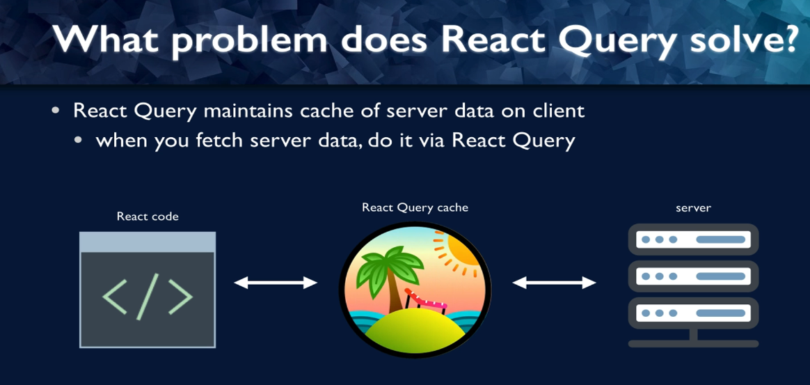
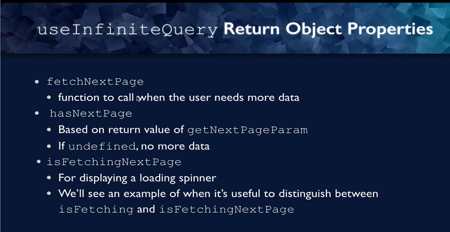

# React Query/TanStack Query: React Server State Management
- React Query is a library that manages server state for our React App
- 

### What problem does React Query solve?
- 
- 
- 
- React Query maintains Loading/Error States
- It gives us tools for Pagination/infinite scroll
- We can pre-fetch data, put it in the cache and then if the user wants data, it can get from the cache
- React Query can also manage mutations or updating the data from the server
- React Query can help in de-duplication of requests
- It also supports Retry on Error
- It also provides callbacks so that we can take actions of query is successful, or it resulted in an error
- 
- 

### First project
- 
- 
- 

### Getting started
- Install React-Query
```shell
npm install @tanstack/react-query
```
- Create a query client(which will manage queries and cache)\
- We will apply a Query Provider which provides client config and cache to the children
- It also takes the query client as the value
- Call useQuery() to fetch data from the server

### Adding a Query Client and Provider
- 
- Add the following code to App.jsx to add the query client and query client provider
```jsx
import { Posts } from "./Posts";
import "./App.css";
import {QueryClient,QueryClientProvider} from "@tanstack/react-query";

const queryClient = new QueryClient();

function App() {
  return (
    // provide React Query client to App
      <QueryClientProvider client={queryClient}>
    <div className="App">
      <h1>Blog &apos;em Ipsum</h1>
      <Posts />
    </div>
      </QueryClientProvider>
  );
}

export default App;

```
- The data we will get from the server looks like this
- 
- To use ReactQuery use the following code:
```jsx
import {useQuery} from "@tanstack/react-query"
const {data} = useQuery({
    //Defines the data inside the query cache. Always an array
    queryKey: ["posts"],
    //Function that will run to fetch the data
    queryFn: fetchPosts,
});
return (
    <>
        <ul>
            {data.map((post) => (
                <li
                    key={post.id}
                    className="post-title"
                    onClick={() => setSelectedPost(post)}
                >
                    {post.title}
                </li>
            ))}
        </ul>
    </>
);
```
- Note that fetchPosts is an async function and it will take some time to return data
- So we need to do this
```jsx
 // replace with useQuery
const {data} = useQuery({
    //Defines the data inside the query cache. Always an array
    queryKey: ["posts"],
    //Function that will run to fetch the data
    queryFn: fetchPosts,
});

if(!data)
{
    return <div>Loading...</div>;
}
return (
    <>
        <ul>
            {data && data.map((post) => (
                <li
                    key={post.id}
                    className="post-title"
                    onClick={() => setSelectedPost(post)}
                >
                    {post.title}
                </li>
            ))}
        </ul>
</>
)
```

### Handling Loading and Error States
- 
- We can make changes as follows to use isLoading and isError
```jsx
const {data, isError, isLoading} = useQuery({
    //Defines the data inside the query cache. Always an array
    queryKey: ["posts"],
    //Function that will run to fetch the data
    queryFn: fetchPosts,
});

if(isLoading)
{
    return <h3>Loading...</h3>;
}
```
### Difference between isLoading and isFetching and isError
- isFetching means the async query hasnt resolved
- isLoading is a subset of that. It means we have noCachedData and data isFetching
- isError means something went wrong
```jsx
if(isError)
  {
      return <h3>Error!</h3>;
  }
```
- Notice that React-Query tries to fetch the data minimum 3 times before it errors out
- This is configurable though
- 

### Using React-Query Dev Tools
- It shows status of all of our queries and last updated timestamp
- It also has a data-explorer to view data returned by query
- It has a query explorer also where we can see the queries
- DEV_TOOLs are not included in production
- It looks at process.env.NODE_ENV === 'development'
- Include them in App.jsx as follows:
```jsx
import { Posts } from "./Posts";
import "./App.css";
import {QueryClient,QueryClientProvider} from "@tanstack/react-query";
import {ReactQueryDevtools} from "@tanstack/react-query-devtools";

const queryClient = new QueryClient();

function App() {
    return (
        // provide React Query client to App
        <QueryClientProvider client={queryClient}>
            <div className="App">
                <h1>Blog &apos;em Ipsum</h1>
                <Posts />
            </div>
            <ReactQueryDevtools />
        </QueryClientProvider>
    );
}

export default App;

```
- 

### What are stale queries?
- Stale data is data that is expired and is ready to be re-fetched
- Data is still in the cache though
- Stale means that Data is stale while revalidating
- This means show this stale data till we get the latest data from server to show latest data
- Data refetch only triggers when data is stale
- Data refetch is also triggered if the component remounts or browser window refocuses
- StaleTime is the maxAge means how much are we willing to tolerate the data being out of date
```jsx
const {data, isError, isLoading} = useQuery({
    //Defines the data inside the query cache. Always an array
    queryKey: ["posts"],
    //Function that will run to fetch the data
    queryFn: fetchPosts,
    staleTime: 2000, //2 seconds
});
```
- Please note data needs to be stale, for refetch triggers to be triggered
- 
- By defaulting to stateTime of 0, we are always assuming data is out of date, and it needs to be refetched from the server
- That makes it much less likely that we will have out of date data on the client application

### Staletime vs gcTime
- 
- 

## Pagination, Pre-fetching and Mutations
- Now we need to fetch the comments.
- 
- We pass the post to a PostDetail component which fetches the comments
- We will make changes to PostDetail component as follows:
```jsx
import { fetchComments } from "./api";
import "./PostDetail.css";
import {useQuery} from "@tanstack/react-query";

export function PostDetail({ post }) {
  console.log(post);
  const {data,isLoading,isError, error } = useQuery({
      queryKey: ["comments",post.id],
      queryFn: ()=> fetchComments(post.id),
  })

    if(isLoading) {
        return(
            <div>Loading...</div>
        )
    }

    if(isError)
    {
        return <h3>Error!</h3>;
    }

  return (
    <>
      <h3 style={{ color: "blue" }}>{post.title}</h3>
      <button>Delete</button> <button>Update title</button>
      <p>{post.body}</p>
      <h4>Comments</h4>
      {data && data.map((comment) => (
        <li key={comment.id}>
          {comment.email}: {comment.body}
        </li>
      ))}
    </>
  );
}

```
### Key Changes Made:
- Fixed queryFn: Changed from fetchComments(post.id) to () => fetchComments(post.id)
- Updated queryKey: Added post.id to the query key as ["comments", post.id] so React Query can cache comments per post

### Why This Matters:
- Without the arrow function: fetchComments(post.id) executes immediately when the component renders, and React Query receives the Promise result instead of a function
- With the arrow function: () => fetchComments(post.id) passes a function that React Query can call when it needs to fetch data

### Understanding Query Keys
- 
- 
- 
- Note the queryFn relies on post.id, so we need to add post.id as a dependency array
- 
- 
- 
- So we can see some active queries and inactive queries
- For inactive queries, the gc time clock is ticking
- After the gctime has passed, they will be automatically garbage collected
- Think of this as, whenever we make a query, the results of that query are cached
- When we make a new query, the results of previous query are still in the cache
- If that old query is reused, then results come straight from the cache, else if gctime has passed, it is garbage collected and removed from cache

### Pagination
- 
- We write the following code in Posts.jsx file
```jsx
import { useState } from "react";

import { fetchPosts, deletePost, updatePost } from "./api";
import { PostDetail } from "./PostDetail";
import {useQuery} from "@tanstack/react-query"
const maxPostPage = 10;

export function Posts() {
  const [currentPage, setCurrentPage] = useState(1);
  const [selectedPost, setSelectedPost] = useState(null);

  const {data, isError, isLoading} = useQuery({
      //Defines the data inside the query cache. Always an array
      queryKey: ["posts", currentPage],
      //Function that will run to fetch the data
      queryFn: ()=> fetchPosts(currentPage),
      staleTime: 2000, //2 seconds
  });

  if(isLoading)
  {
      return <h3>Loading...</h3>;
  }
  if(isError)
  {
      return <h3>Error!</h3>;
  }
  return (
    <>
      <ul>
        {data && data.map((post) => (
          <li
            key={post.id}
            className="post-title"
            onClick={() => setSelectedPost(post)}
          >
            {post.title}
          </li>
        ))}
      </ul>
      <div className="pages">
        <button disabled = {currentPage <= 1} onClick={() => {
            setCurrentPage((previousValue) => previousValue - 1);
        }}>
          Previous page
        </button>
        <span>Page {currentPage}</span>
        <button disabled = {currentPage >= maxPostPage} onClick={() => {
            setCurrentPage((previousValue) => previousValue + 1)
        }}>
          Next page
        </button>
      </div>
      <hr />
      {selectedPost && <PostDetail post={selectedPost} />}
    </>
  );
}

```

### Prefetching data
- 
- Prefetching is a method of the query client
- We can get a reference to the query client inside a component using the useQueryClient hook
- We have a prefetch query function that will fetch data for the next page
- We have to prefetch the data inside the useEffect to keep tracking of which page we are on and we want to run this function when we go to the next page
```jsx
const [currentPage, setCurrentPage] = useState(1);
const [selectedPost, setSelectedPost] = useState(null);

const queryClient = useQueryClient();

useEffect(() => {
    if(currentPage < maxPostPage) {
        const nextPage = currentPage + 1;
        queryClient.prefetchQuery({
            query: ["posts", nextPage],
            queryFn: () => fetchPosts(nextPage),
        });
    }
},[currentPage,queryClient]);

const {data, isError, isLoading} = useQuery({
    //Defines the data inside the query cache. Always an array
    queryKey: ["posts", currentPage],
    //Function that will run to fetch the data
    queryFn: ()=> fetchPosts(currentPage),
    staleTime: 2000, //2 seconds
});
```
- This really reduces loading time and provides a nice experience to the user

### isLoading vs isFetching
- 
```jsx
// First time loading
data: undefined
isLoading: true    // Show spinner
isFetching: true

// Background refetch with cached data
data: [...existing data...]
isLoading: false   // Don't show spinner
isFetching: true   // Still fetching new data

```
- Use isLoading when you want to show a loading spinner only for the initial data load.
- Use isFetching when you want to indicate any network activity, including background refreshes.
- For most UI patterns, isLoading is preferred because it prevents showing loading spinners every time React Query refetches data in the background.
- isLoading indicates initial data fetch, isFetching shows any ongoing fetch process

### Intro to Mutations
- 
- 
- To add a delete mutation add the following code to Posts.jsx
- Note that we can pass arguments to mutations
```jsx
import {useQuery, useQueryClient, useMutation} from "@tanstack/react-query"
import { fetchPosts, deletePost, updatePost } from "./api";

const deleteMutation = useMutation({
    //No need to add mutation Key
    mutationFn: (postId) => deletePost(postId),
})

{selectedPost && <PostDetail post={selectedPost} deleteMutation = {deleteMutation} />}
```
- Now inside the PostDetail component we have this code:
```jsx
export function PostDetail({ post, deleteMutation }) {
    const {data,isLoading,isError, error } = useQuery({
        queryKey: ["comments",post.id],
        queryFn: ()=> fetchComments(post.id),
    })

    return (
        <>
            <h3 style={{ color: "blue" }}>{post.title}</h3>
            // Specify arguments for the mutation
            <button onClick={()=>deleteMutation.mutate(post.id)}>Delete</button> <button>Update title</button>
            <p>{post.body}</p>
            <h4>Comments</h4>
            {data && data.map((comment) => (
                <li key={comment.id}>
                    {comment.email}: {comment.body}
                </li>
            ))}
        </>
    );
```
- The arguments for useMutation are less than that for useQuery
- There is no isLoading and isFetching properties
- We do have isPending
```jsx
return (
    <>
      <h3 style={{ color: "blue" }}>{post.title}</h3>
      <div>
        <button onClick={()=>deleteMutation.mutate(post.id)}>
            Delete
        </button>
          {deleteMutation.isPending && (
              <p className="loading">Deleting the Post</p>
          )}
          {deleteMutation.isError && (
              <p className="error">Error Deleting the Post: {deleteMutation.error.toString()}</p>
          )}
          {deleteMutation.isSuccess && (
              <p className="success">Post was Deleted</p>
          )}
      </div>
          <button>Update title</button>
      <p>{post.body}</p>
      <h4>Comments</h4>
      {data && data.map((comment) => (
        <li key={comment.id}>
          {comment.email}: {comment.body}
        </li>
      ))}
    </>
  );
```
- We need to reset the mutation when we click on a different post
- The reset function resets all the mutation properties
- This can be done by the following code:
```jsx
return (
    <>
      <ul>
        {data && data.map((post) => (
          <li
            key={post.id}
            className="post-title"
            onClick={() => {
                deleteMutation.reset()
                setSelectedPost(post);
            }}
          >
            {post.title}
          </li>
        ))}
      </ul>
)
```
### Updating the Post Title
- 
- The code is exactly similar to deleteMutation code above
```jsx

const updateMutation = useMutation({
        mutationFn: (postId) => updatePost(postId),
    })
    
 <div>
          <button onClick={()=>updateMutation.mutate(post.id)}>
              Update title
          </button>
            {updateMutation.isPending && (
                <p className="loading">Updating the Post</p>
            )}
            {updateMutation.isError && (
                <p className="error">Error Updating the Post: {updateMutation.error.toString()}</p>
            )}
            {updateMutation.isSuccess && (
                <p className="success">Post was Updated</p>
            )}
</div>
```
### Summary of React-Query Basics
- 

## Infinite Scroll - Infinite Queries for Loading Data (Just in Time)
- 
- We will use a new hook useInfiniteQuery
- 
- 

```jsx
import "./App.css";
import { InfinitePeople } from "./people/InfinitePeople";
import { InfiniteSpecies } from "./species/InfiniteSpecies";
import {QueryClient,QueryClientProvider} from "@tanstack/react-query";
import {ReactQueryDevtools} from "@tanstack/react-query-devtools";

function App() {
  return (
      <QueryClientProvider client={queryClient}>
    <div className="App">
      <h1>Infinite SWAPI</h1>
      <InfinitePeople />
      {/* <InfiniteSpecies /> */}
    </div>
          <ReactQueryDevtools />
      </QueryClientProvider>
  );
}

export default App;

```
### useInfiniteQuery
- 
- 
- 
- 
- 
- Initial when the component mounts and we fetch the first page, the data is undefined
- Then we fetch the first page
- 
- It sets the first property of the data.pages object
- After we get the data back, React Query will run the getNextPageParam
- 
- Then we check if there is a next Page
- 
- Then we run the getNextPageParam
- If getNextPageParam is undefined, it means there are no more pages
- So hasNextPage is false and we are done
- 
- Initial code for useInfiniteQuery is as follows:
```jsx
import InfiniteScroll from "react-infinite-scroller";
import { Person } from "./Person";
import {useInfiniteQuery} from "@tanstack/react-query"

const initialUrl = "https://swapi-node.now.sh/api/people";
const fetchUrl = async (url) => {
  const response = await fetch(url);
  return response.json();
};

export function InfinitePeople() {

    //fetch Next page is called when we want to load more data
  const {data, fetchNextPage, hasNextPage} = useInfiniteQuery({
    queryKey:["sw-people"],
    queryFn: ({pageParam = initialUrl}) => fetchUrl(pageParam),
    getNextPageParam: (lastPage) =>{
      return lastPage.next || undefined;
    }
  })
```
### React Infinite Scroller
- 
- Code will be as follows:
```jsx
import InfiniteScroll from "react-infinite-scroller";
import { useInfiniteQuery } from "@tanstack/react-query";
import { Person } from "./Person";

const baseUrl = "https://swapi-node.vercel.app";
const initialUrl = baseUrl + "/api/people/";
const fetchUrl = async (url) => {
  const response = await fetch(url);
  return response.json();
};

export function InfinitePeople() {
  const {
    data,
    fetchNextPage,
    hasNextPage,
    isFetching,
    isLoading,
    isError,
    error,
  } = useInfiniteQuery({
    queryKey: ["sw-people"],
    queryFn: ({ pageParam = initialUrl }) => fetchUrl(pageParam),
    getNextPageParam: (lastPage) => {
      return lastPage.next ? baseUrl + lastPage.next : undefined;
    },
  });

  if (isLoading) {
    return <div className="loading">Loading...</div>;
  }

  if (isError) {
    return <div>Error! {error.toString()}</div>;
  }

  return (
      <>
        {isFetching && <div className="loading">Loading...</div>}
        <InfiniteScroll
            loadMore={() => {
              if (!isFetching) {
                fetchNextPage();
              }
            }}
            hasMore={hasNextPage}
        >
          {data.pages.map((pageData) => {
            return pageData.results.map((person) => {
              return (
                  <Person
                      key={person.fields.name}
                      name={person.fields.name}
                      hairColor={person.fields.hair_color}
                      eyeColor={person.fields.eye_color}
                  />
              );
            });
          })}
        </InfiniteScroll>
      </>
  );
}
```
- We can write similar code for InfiniteSpecies

### Bi-directional Scrolling
- 
- getPreviousPageParam
- 

## React Query in a larger app
- 


